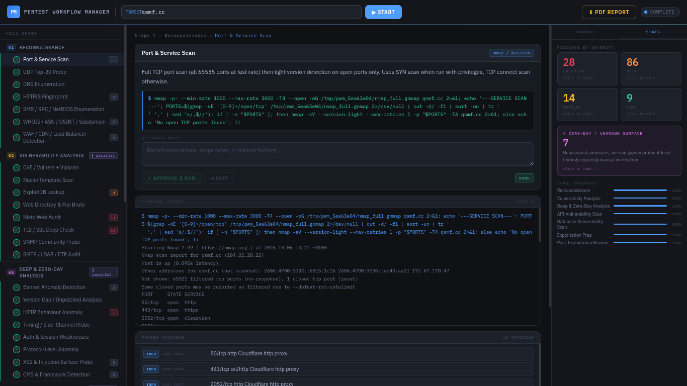

# Pentest Workflow Manager (PWM)

## Features

- 7-stage automated "kill chain" workflow: Reconnaissance, Vulnerability Analysis, Deep & Zero-Day Analysis, API Vulnerability Scan, Database Vulnerability Scan, Exploitation Prep, and Post-Exploitation Review
- Flask-based web app with live, real-time output streaming (Server-Sent Events) to a browser frontend
- Port and service scanning via nmap / masscan (full TCP sweep + targeted service/version detection)
- UDP service probing (SNMP, DNS, TFTP, NTP, LDAP, etc.)
- DNS enumeration, zone transfer attempts, and DMARC/wildcard checks
- HTTP/S fingerprinting, WAF/CDN detection, and technology stack identification
- SMB/RPC/NetBIOS enumeration (null sessions, share listing, domain/user enumeration)
- WHOIS, ASN, certificate transparency, and OSINT/subdomain discovery
- CVE mapping via nmap vulners/vulscan and Nuclei template scanning
- ExploitDB lookups via searchsploit
- Web directory/file brute-forcing (gobuster/ffuf) and Nikto web audits
- Deep TLS/SSL analysis (cipher suites, Heartbleed, POODLE, ROBOT, CRIME, BEAST, SWEET32)
- SNMP community string probing
- SMTP/LDAP/FTP security audits
- Banner anomaly detection and version-gap/EOL analysis against a built-in version database
- HTTP behaviour anomaly probes (path traversal, verb tampering, host header injection)
- Timing/side-channel probes for blind SQL injection and authentication oracles
- Authentication and session weakness checks (default credentials, cookie flags)
- XSS, SSTI, XXE, and open-redirect injection surface probing
- CMS and framework detection (WordPress, Drupal, Joomla, Laravel, Django, Rails)
- OWASP API Top-10 style testing: endpoint discovery, BOLA/IDOR, broken authentication, injection, SSRF, mass assignment, and misconfiguration checks
- Database vulnerability scanning across MySQL, PostgreSQL, MongoDB, Redis, MSSQL, Oracle, Cassandra, Elasticsearch, InfluxDB, and Neo4j
- Unauthenticated database access and default credential testing
- Automated SQL injection auditing via sqlmap, plus manual and second-order SQLi probes
- NoSQL injection detection
- Database privilege and configuration auditing
- Exploitation preparation: default credential brute-forcing (hydra), Metasploit safe (non-destructive) checks, sqlmap verification, and exploit/CVE cross-referencing
- Post-exploitation review: network segment discovery, privilege escalation vector lookup, high-value service mapping, credential/secret harvesting, and Active Directory enumeration
- Structured findings output with severity ratings, affected paths, and remediation commands
- PDF report generation with proof-of-concept and code-fix remediation examples
- Command injection safeguards via target input validation and sanitization
- Optional API token authentication for API routes

## Installation

```bash
git clone https://github.com/spidermalops/PWM.git
```

## Setup

```bash
cd PWM
```

**Linux / macOS**

```bash
python3 -m venv venv && source venv/bin/activate
```

**Windows**

```bash
python -m venv venv
source venv\Scripts\activate
```

## Usage

**Linux / macOS**

```bash
python3 app.py
```

**Windows**

```bash
python app.py
```

## Screenshot


